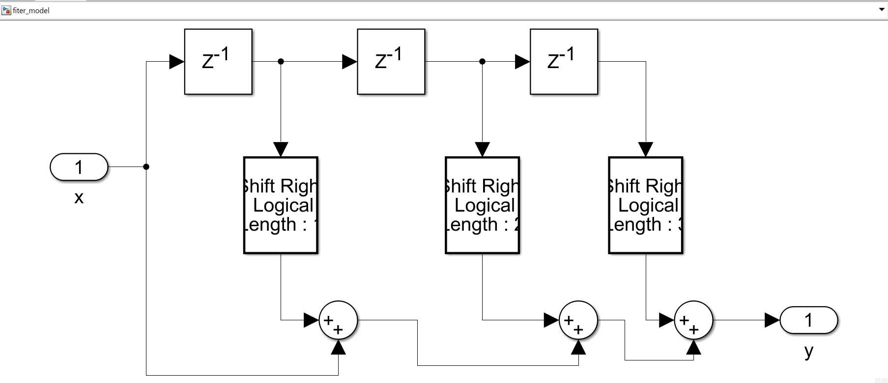

# DSP Filter Implementation and Comparison

This project involves designing a weighted moving average filter in three different ways: using MATLAB scripting, Simulink with HDL Coder, and a custom hand-coded Verilog implementation. The goal is to evaluate and compare the functionality, resource utilization, and performance of each approach.

## Table of Contents
1. [Introduction](#introduction)
2. [Project Structure](#project-structure)
3. [Filter Design](#filter-design)
4. [Implementation Approaches](#implementation-approaches)
    - [MATLAB Model](#matlab-model)
    - [Simulink Model and Generated RTL](#simulink-model-and-generated-rtl)
    - [Hand-Coded RTL (Verilog)](#hand-coded-rtl-verilog)
5. [Comparison](#comparison)
    - [Functionality](#functionality)
    - [Resource Utilization](#resource-utilization)
    - [Performance](#performance)
6. [Testbench](#testbench)
7. [How to Run](#how-to-run)
8. [Conclusion](#conclusion)
9. [Future Work](#future-work)

## Introduction
This project implements a DSP filter as a weighted moving average filter with coefficients `[1, 0.5, 0.25, 0.125]`. The filter was implemented in three ways:
- MATLAB script for functional simulation and validation.
- Simulink model with HDL Coder for RTL code generation.
- Hand-coded RTL in Verilog.

The focus is on comparing these implementations in terms of functionality, efficiency, and resource usage.



## Project Structure
```
project/
│
├── MATLAB/
│   ├── dsp_filter.m          # MATLAB filter model and test script
│   ├── input.txt             # Input values for testing
│   └── output.txt            # Expected output values
│
├── Simulink/
│   ├── fiter_model.slx       # Simulink model of the DSP filter
│   └── fiter_model.v         # RTL generated by HDL Coder
│
├── Verilog/
│   ├── DSP_Filter.v          # Hand-coded Verilog RTL
│   └── DSP_Filter_tb.v       # Testbench for the Verilog RTL
│
└── README.md                 # Project documentation
```

## Filter Design
The DSP filter is designed as a weighted moving average filter using the coefficients:
\[ H = [1, 0.5, 0.25, 0.125] \]

This design is implemented directly in MATLAB, then translated into a Simulink model, and finally hand-coded in Verilog for comparison.

## Implementation Approaches

### MATLAB Model
The MATLAB implementation provides a baseline for validating the filter’s functionality. It uses random input values and computes the output based on the filter coefficients.

#### MATLAB Code Snippet:
```matlab
% MATLAB model of the DSP_Filter 
clear;
H = [1, 0.5, 0.25, 0.125];
x = randi([0, 2^7-1], 1, 100);  % Random 8-bit unsigned values
y = zeros(1, 100);
delayed_x = zeros(3, 1);

for i = 1:100
    delayed_x(3) = delayed_x(2);
    delayed_x(2) = delayed_x(1);
    delayed_x(1) = x(i);
    y(i) = H * [x(i), delayed_x']';
end
```

### Simulink Model and Generated RTL
The Simulink model, designed using blocks for delay, addition, and multiplication, is used to generate Verilog RTL via HDL Coder.

#### Simulink Generated RTL Snippet:
```verilog
// Simulink Generated RTL for DSP Filter
module fiter_model
    (input clk,
     input reset,
     input clk_enable,
     input [7:0] x,
     output reg [7:0] y);

    // Delays and shifts implementing the weighted average
    always @(posedge clk) begin
        if (reset) begin
            // Reset logic
        end else if (clk_enable) begin
            // Filtering logic with shifts to reduce resource usage
        end
    end
endmodule
```

### Hand-Coded RTL (Verilog)
The custom Verilog implementation emphasizes accuracy, using multipliers instead of shifts. This approach sacrifices some resource efficiency for improved accuracy.

#### Verilog Code Snippet:
```verilog
module DSP_Filter #(parameter N=7)(
    input clk,
    input rst,
    input [N:0] x,
    output reg [N:0] y
);

reg [N:0] delayed_x [2:0];

always @(posedge clk or negedge rst) begin
    if (!rst) begin
        delayed_x[0] <= 0;
        delayed_x[1] <= 0;
        delayed_x[2] <= 0;
    end else begin
        delayed_x[2] <= delayed_x[1];
        delayed_x[1] <= delayed_x[0];
        delayed_x[0] <= x;
    end
end

always @(*) begin
    y = x + (delayed_x[0] * 0.5) + (delayed_x[1] * 0.25) + (delayed_x[2] * 0.125);
end
endmodule
```

## Comparison

### Functionality
| Implementation        | Functional Accuracy | Efficiency   |
|-----------------------|---------------------|--------------|
| MATLAB                | High                | N/A          |
| Simulink Generated    | High                | Optimized    |
| Hand-Coded Verilog    | Very High           | Less Optimized |

### Resource Utilization
| Metric                | Simulink Generated | Hand-Coded Verilog |
|-----------------------|--------------------|--------------------|
| LUTs                  | Low                | High               |
| Flip-Flops            | Low                | High               |
| DSP Blocks            | Minimal            | Moderate           |

### Performance
Both implementations meet the performance requirements for the filter, operating correctly at the specified frequency of 100 MHz.

## Testbench
Testbenches are provided for both the MATLAB generated and hand-coded RTL implementations. They validate functionality using the provided input and output files (`input.txt`, `output.txt`).

#### Testbench Snippet for Verilog:
```verilog
module DSP_Filter_tb;
    reg clk;
    reg rst;
    reg [7:0] x;
    wire [7:0] y;
    reg [7:0] input_file [0:99];
    reg [7:0] output_file [0:99];
    integer i;

    DSP_Filter dut (.clk(clk), .rst(rst), .x(x), .y(y));

    always #5 clk = ~clk; // Clock generation

    initial begin
        clk = 0;
        rst = 1;
        #10 rst = 0;
        #10 rst = 1;

        $readmemh("input.txt", input_file);
        $readmemh("output.txt", output_file);

        for (i = 0; i < 100; i = i + 1) begin
            x = input_file[i];
            #10;
            if (y !== output_file[i]) $display("Mismatch at index %d: expected %h, got %h", i, output_file[i], y);
        end
        $stop;
    end
endmodule
```
**Wave in the test cases**


## How to Run
1. **MATLAB:**
   - Run the MATLAB script `dsp_filter.m` to validate the filter functionality and generate test data.
2. **Simulink and HDL Coder:**
   - Open `fiter_model.slx` in Simulink and use HDL Coder to generate RTL.
3. **Verilog:**
   - Use any HDL simulator to run `DSP_Filter_tb.v`, ensuring the `input.txt` and `output.txt` are in the same directory.

## Conclusion
The MATLAB generated RTL is resource-efficient but slightly less accurate, while the hand-coded RTL offers greater accuracy with increased resource usage. Depending on the application requirements, either approach can be utilized effectively.


---
